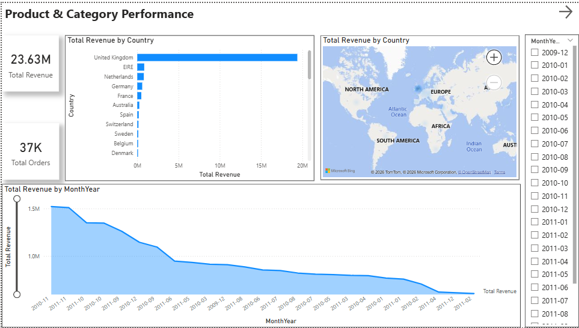
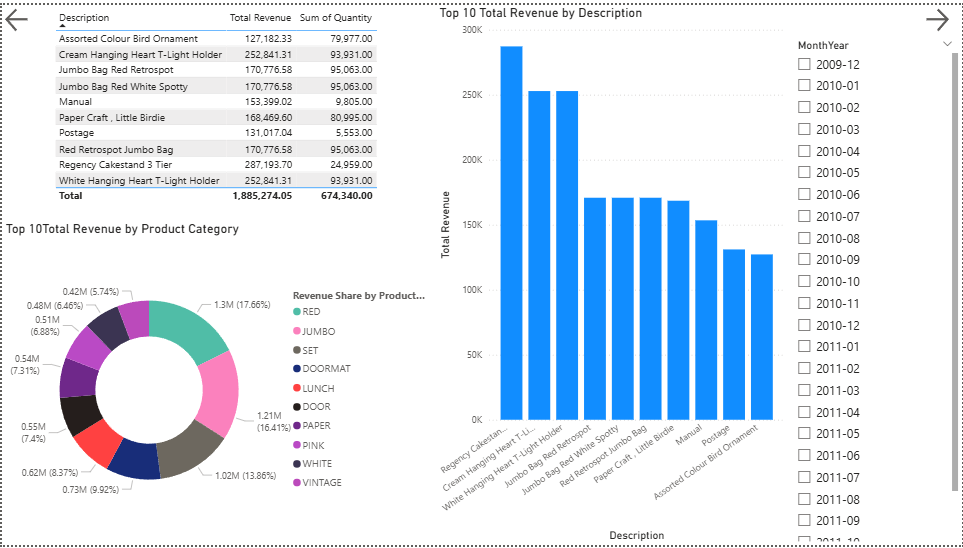
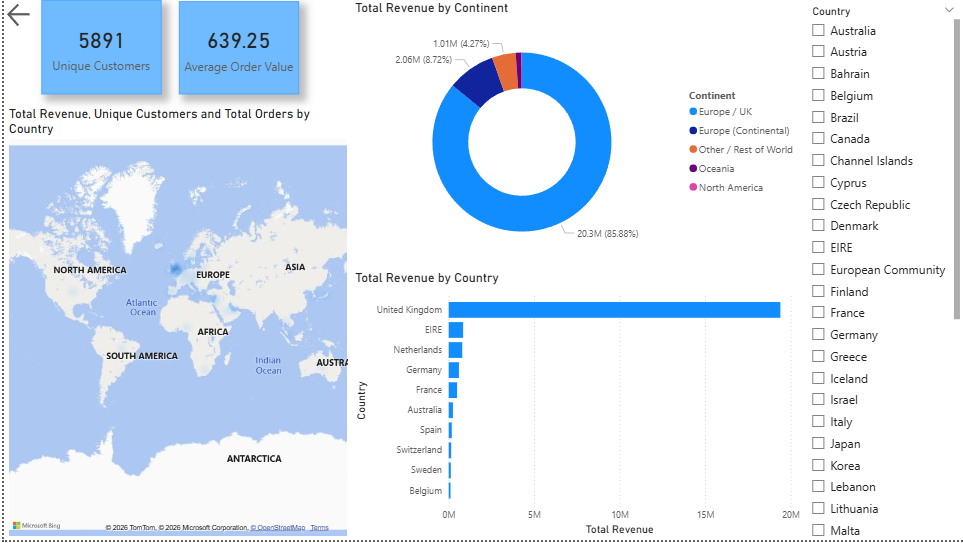

# E-Commerce Sales Dashboard  
**End-to-End Analytics Portfolio Project – Dilmy**

A complete data analysis & visualization showcase demonstrating skills in **data preparation**, **SQL analytics**, **dimensional modeling**, and **interactive BI reporting** for a real-world e-commerce use case.

**Dataset**  
Online Retail II  
~1 million transactions from a UK-based online gift & home décor retailer (Dec 2009 – Dec 2011)

**Important – Dataset is not included in this repository** (file size ~100–500 MB)  
Download from one of these official sources:  
- Kaggle (recommended – clean & easy):  
  https://www.kaggle.com/datasets/mashlyn/online-retail-ii-uci  
- Alternative Kaggle version:  
  https://www.kaggle.com/datasets/carrie1/ecommerce-data  
- Original UCI Machine Learning Repository:  
  https://archive.ics.uci.edu/dataset/502/online+retail+ii

## Business Objective

Analyze transactional data to uncover:  
- Revenue trends & seasonality  
- Product & category performance  
- Customer behavior (AOV, repeat rate)  
- Geographic distribution & concentration risk  

Deliver insights through a clean, interactive Power BI dashboard.

## Tools & Technologies

| Layer                  | Technology / Tool                          | Role / Deliverables                                                                 |
|------------------------|--------------------------------------------|-------------------------------------------------------------------------------------|
| Programming            | Python 3.9+                                | Core scripting language                                                             |
| Data Wrangling         | Pandas, NumPy                              | Cleaning, transformation, feature engineering, EDA                                 |
| Exploratory Viz        | Matplotlib, Seaborn                        | Initial histograms, bar charts, time series plots                                   |
| Database               | SQLite                                     | Local star-schema storage (dim & fact tables)                                       |
| SQL                    | SQL (joins, aggregations, CTEs, window functions) | Analytical queries (top-N, monthly trends, AOV by country, etc.)                    |
| BI Tool                | Power BI Desktop                           | Data modeling, DAX calculations, report & dashboard design                          |
| DAX                    | DAX (measures & calculated columns)        | KPIs, dynamic Top N, time intelligence (YoY), percentage calculations               |
| Interactivity          | Power BI slicers & what-if parameters      | Country, time period, Top N dynamic filtering                                       |
| Version Control        | Git + GitHub                               | Source control & public portfolio showcase                                          |

## Project Workflow (Step-by-Step)

1. **Data Acquisition**  
   Downloaded Online Retail II CSV from Kaggle/UCI

2. **Data Cleaning & Preparation** (Python – Pandas)  
   - Removed/handled cancellations (Invoice starts with 'C')  
   - Filtered negative quantities & zero/negative prices  
   - Dropped rows with missing CustomerID  
   - Created TotalPrice = Quantity × UnitPrice  
   - Engineered MonthYear, DateKey, DayOfWeek, Hour, etc.  
   - Output: cleaned CSV

3. **Dimensional Modeling & SQLite Database**  
   - Built dimension tables: dim_date, dim_customer, dim_product  
   - Built fact_sales with surrogate keys (DateKey, CustomerKey, ProductKey)  
   - Loaded into SQLite (`ecommerce_analytics.db`)

4. **Analytical SQL Layer**  
   Created multiple reusable queries (saved as separate `.sql` files):  
   - Top 10 countries by revenue  
   - Monthly revenue trend  
   - Top 10 products by revenue & units sold  
   - Average Order Value by country (with order count threshold)  
   - Revenue by day of week

5. **Power BI Dashboard**  
   - Connected to SQLite via ODBC  
   - Established star schema relationships  
   - Created core DAX measures (Total Revenue, AOV, Unique Customers, dynamic Top N, etc.)  
   - Designed three focused report pages

## Dashboard Structure – 3 Focused Pages

1. **Overview – Sales Performance Snapshot**  
   - KPIs: Total Revenue, Total Orders, AOV, Unique Customers, Repeat Rate %, UK Revenue %  
   - Monthly revenue trend (line chart)  
   - Top countries bar chart  
   - Slicers: Month/Year, Country

2. **Product Performance**  
   - Dynamic Top N products table (what-if parameter for N)  
   - Revenue share by product category (donut chart – proxy or grouped)  
   - Revenue by category over time (stacked column)  
   - Slicer: Month/Year

3. **Geography Insights**  
   - Revenue by country (bubble or filled map)  
   - Top 10 countries bar/column chart  
   - AOV by country (table or bar)  
   - Slicers: Country, Month/Year
   - 
## Screenshots
  
  


## Repository Contents
```
ecommerce-sales-dashboard/
├── data/
├── powerbi/
│   └── ecommerce_sales_dashboard.pbix              # Main Power BI file
├── notebooks/
│   └── 01_data_cleaning_eda.ipynb                  # Python cleaning & EDA notebook
├── sql/
│   └── analytical_queries/                         # Individual .sql files
├── screenshots/                                    # Dashboard page images
└── README.md
```

**Dataset files are not included** – download from links above.

## How to Explore the Project

1. **Clone the repository**
   ```bash
   git clone https://github.com/dilmyperera/Ecommerce_Sales_Analytics.git
   
2. **Download the dataset**
- Use one of the links at the top of this README
3. Open the Power BI file
- Navigate to powerbi/ folder
- Double-click ecommerce_sales_dashboard.pbix
- Requires Power BI Desktop (free): https://powerbi.microsoft.com/desktop/

## Key Learnings & Value

- Complete ownership of the analytics pipeline
- Effective star schema design for performant reporting
- Practical application of analytical SQL
- Dynamic, business-user-friendly dashboards (slicers, parameters, drill-down)
- Connecting data insights to real business questions

## Future Ideas (if revisited)

- Customer RFM segmentation
- Basic forecasting (Power BI built-in or external)
- Power BI Service deployment with scheduled refresh
- Executive summary & formal recommendations page

